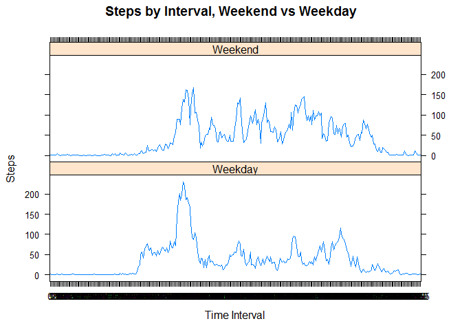

# Reproducible Research: Peer Assessment 1


## Loading and preprocessing the data


```r
data <- read.csv("activity.csv")
data$steps <- as.numeric(data$steps)
data$interval <- as.factor(data$interval)
data$date <- as.Date(data$date)
library(plyr)
```

## What is mean total number of steps taken per day?


```r
sumsteps <- ddply(data, .(date), summarize, totalsteps = sum(steps,na.rm=TRUE))
hist(sumsteps$totalsteps,main=paste("Histogram of Total Steps Per Day"), xlab="Steps/Day")
```

 

```r
summary(sumsteps$totalsteps)
```

```
##    Min. 1st Qu.  Median    Mean 3rd Qu.    Max. 
##       0    6778   10400    9354   12810   21190
```

## What is the average daily activity pattern?


```r
meanbyinterval <- aggregate(data$steps~data$interval, FUN=mean, exclude="NA")
plot(meanbyinterval, type="l",main=paste("Average Steps by Time of Day"), xlab="Time Interval", ylab="Average Steps")
```

 


```r
meanbyinterval[which.max(meanbyinterval[,2]),1]
```

```
## [1] 835
## 288 Levels: 0 5 10 15 20 25 30 35 40 45 50 55 100 105 110 115 120 ... 2355
```

## Imputing missing values

1. Calculate and report the total number of missing values in the data set


```r
sum(is.na(data$steps))
```

```
## [1] 2304
```

2 and 3. Replace missing data with average for that time interval


```r
newdata <- data
for(i in 1:nrow(newdata)){
        if(is.na(newdata[i,1])){
                newdata[i,1] <- meanbyinterval[(which(meanbyinterval[,1] == newdata[i,3])),2]              
                
        }
}
```

4. Recalculate total steps per day, and mean/median, using new data set with imputed values


```r
sumsteps <- ddply(newdata, .(date), summarize, totalsteps = sum(steps))
hist(sumsteps$totalsteps,main=paste("Histogram of Total Steps Per Day"), xlab="Steps/Day")
```

 

```r
summary(sumsteps$totalsteps)
```

```
##    Min. 1st Qu.  Median    Mean 3rd Qu.    Max. 
##      41    9819   10770   10770   12810   21190
```

## Are there differences in activity patterns between weekdays and weekends?


```r
newdata$day <- weekdays(as.Date(newdata$date))
newdata$weekpart <- ifelse(newdata$day == "Sunday" | newdata$day == "Saturday", c("Weekend"), c("Weekday"))
newdata$weekpart <- as.factor(newdata$weekpart)
newmeanbyinterval <- aggregate(newdata$steps~newdata$interval+newdata$weekpart, FUN=mean)

library(lattice)

xyplot(newmeanbyinterval[,3]~newmeanbyinterval[,1]|newmeanbyinterval[,2], type="l", layout=c(1,2), xlab="Time Interval", ylab="Steps", main="Steps by Interval, Weekend vs Weekday")
```

 
